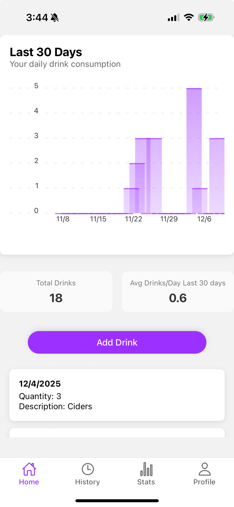
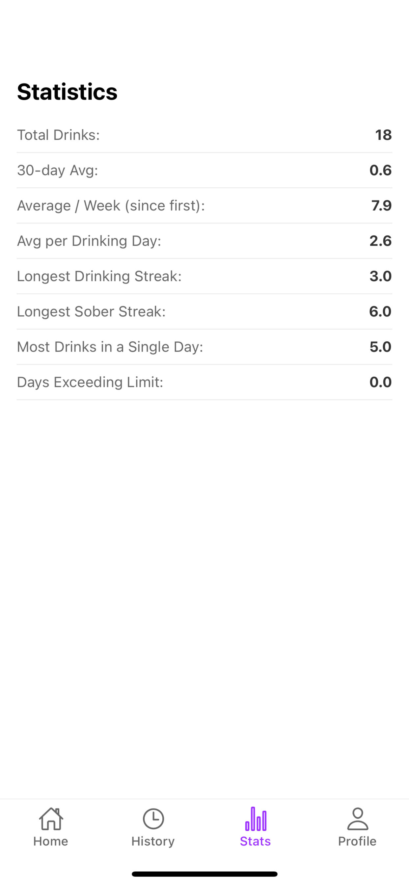
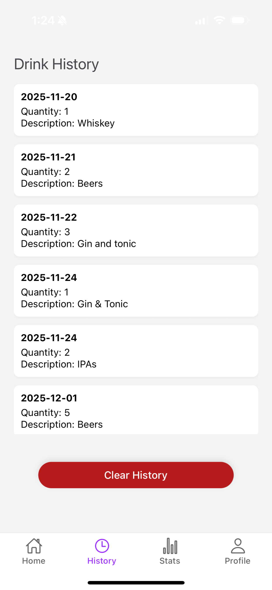
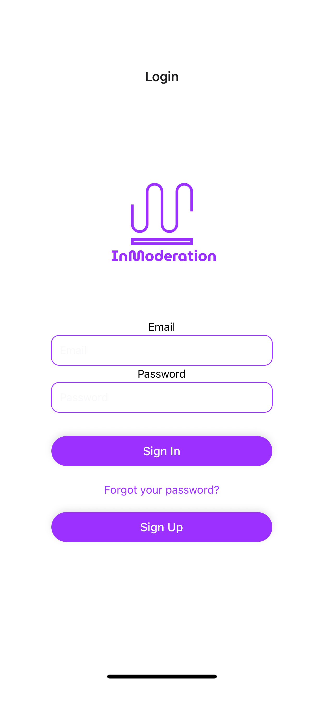

# InModeration

**InModeration** is a minimal React Native app designed for quickly tracking and visualizing alcohol consumption habits.  

The app focuses on simplicity and speed, providing users with a history of their drinks and a chart for quick understanding. 

<p align="center">
  
</p>

---

## Features

- A chart plotting historical consumption
- Statistics on consumption 
- Maintains a **history of logged drinks** per user  
- Simple and minimal **mobile-friendly UI**  
- Supabase authentication (email/password)  
- Supports both **iOS and Android** via Expo  

---

## Screens

1. **Home** – A chart showing consumption history and most log entries.  
<p align="center">
  
</p>
2. **Statistics** – Shows the statistics around consumption. 
<p align="center">
  
</p>
3. **History** – Displays your logged history; allows clearing history.  
<p align="center">
  
</p>
4. **Login** - Users sign back into the app.
<p align="center">
  
</p>
5. **SignUp** - New users register for the app.
<p align="center">
  
</p>

---

## Tech Stack

- **Frontend:** React Native (Expo)  
- **Backend / Database:** Supabase  
- **Authentication:** Supabase email/password  
- **Icons & UI:** Ionicons, basic React Native components  

--- 

## Deployment

1. iOS App Store:

```bash
eas build --platform ios
eas submit -p ios
```

2. Google Play Store: 

```bash
eas build --platform android
eas submit -p android
```
---

## Installation

1. Clone the repository:

```bash
git clone https://github.com/yourusername/InModerationApp.git
cd inmoderation
```

2. Install dependencies:

```bash
npm install
```

3. Create a `.env` file in the project root with your Supabase keys:

```
SUPABASE_URL=your-supabase-url
SUPABASE_KEY=your-supabase-key
```

4. Start the app:

```bash
expo start
```

---

## Usage

1. Open the app on your device or simulator.  
2. Enter drinks consumed on the Home screen.  
3. Navigate to the Statistics screen to see statistics.
4. Navigate to the History screen to view your data.  
5. Clear history using the **Clear History** button if desired.  

---

## Next Features

Future contributions may include:

- Enhanced UI and theming  
- Expanded data sources for more comprehensive coverage  

---

## License

MIT License. See `LICENSE` for details.